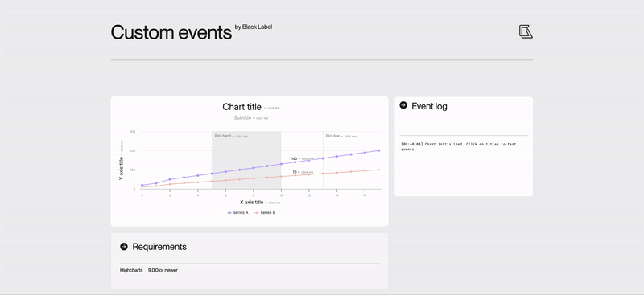

# Custom Events – Highcharts Module

[](https://www.npmjs.com/package/highcharts-custom-events)

**Custom Events** is an official [Black Label](https://blacklabel.net/highcharts/) plugin for Highcharts, extending the charting library with DOM-like event binding (`click`, `dblclick`, `contextmenu`, etc.) for chart elements such as labels, titles, series, and crosshairs. The plugin is built as a separate add-on to the Highcharts library, owned and maintained by Highsoft AS.

This module is the result of our long-standing collaboration with Highsoft, where we’ve been a trusted partner since 2010 — helping build, maintain, and expand the Highcharts ecosystem. With custom events, you can easily create richer interactivity and deliver better user experiences, without relying on complex workarounds.


➖ [Live demo](https://blacklabel.github.io/custom_events/)  
➖ [GitHub repository](https://github.com/blacklabel/custom_events)


---

## Table of Contents
- [Getting Started](#getting-started)
  - [Compatibility](#compatibility)
  - [Installation](#installation)
- [Usage](#usage)
- [Available Events](#available-events)
- [Supported Elements](#supported-elements)
- [Development Setup](#development-setup)
- [Using the Plugin Locally in index.html](#using-the-plugin-locally-in-indexhtml)

---

## Getting Started

### Compatibility

| Custom Events Version | Highcharts Version |
| --------------------- | ------------------ |
| **4.0.0+**            | `>= 9.0.0`         |
| **3.x.x**             | `< 9.0.0`          |

---

## Installation

Install via NPM:

```bash
npm install highcharts highcharts-custom-events
# or
yarn add highcharts highcharts-custom-events
# or
pnpm add highcharts highcharts-custom-events
```

Then import and initialize:
```js
import Highcharts from "highcharts";
import HighchartsCustomEvents from "highcharts-custom-events";

HighchartsCustomEvents(Highcharts);
```

Or include via a <script> tag after loading Highcharts:
```js
<script src="https://code.highcharts.com/highcharts.js"></script>
<script src="https://blacklabel.github.io/custom_events/js/customEvents.js"></script>
```

---

## Usage

Attach events in the same way you would with Highcharts’ built-in event handlers:
```js
Highcharts.chart('container', {
  xAxis: {
    labels: {
        events: {
          click: function () {
            console.log('Click on xAxis label');
          },
          dblclick: function () {
            console.log('Double click on xAxis label');
          },
          contextmenu: function () {
            console.log('Right click on xAxis label');
          }
        }
    }    
  },
  crosshair: {
    enabled: true,
    events: {
      mouseover: function () {
        console.log('Mouse over crosshair');
      }
    }
  },
  series: [{
    data: [1, 2, 3, 4, 5]
  }]
});
```

---

## Available Events
| Event         | Description                              |
| ------------- | ---------------------------------------- |
| `click`       | Fires on click                           |
| `dblclick`    | Fires on double click (desktop & mobile) |
| `contextmenu` | Fires on right click                     |
| `mouseover`   | Fires when hovering over element         |
| `mouseout`    | Fires when leaving element               |
| `mousedown`   | Fires when mouse button pressed          |
| `mousemove`   | Fires when moving cursor over element    |

## Supported Elements
| Element       | Notes              |
| ------------- | ------------------ |
| `title`       | Chart title        |
| `subtitle`    | Chart subtitle     |
| `axis.labels` | Axis labels        |
| `axis.title`  | Axis title         |
| `plotLines`   | Including labels   |
| `plotBands`   | Including labels   |
| `point`       | Single data point  |
| `series`      | Entire series      |
| `legend`      | Legend items       |
| `dataLabels`  | Series data labels |
| `flags`       | Flags series       |
| `crosshair`   | Crosshairs         |


---

## Development Setup

If you want to work on this plugin locally:

1. Clone the repository
```bash
git clone https://github.com/blacklabel/custom_events.git
cd custom_events
```
2. Install dependencies
```bash
npm install
# or
yarn install
```
3. Start a local dev server
```bash
npm start
```
This will launch a local server (via http-server or similar) and open the demo page in your browser.

4. Build the plugin
```bash
npm run build
```
The compiled file will be available in the dist/ folder.

---
## Using the Plugin Locally in index.html
After building, include the plugin file after Highcharts in your index.html:
```html
<!DOCTYPE html>
<html lang="en">
<head>
  <meta charset="UTF-8">
  <title>Highcharts Custom Events - Local Dev</title>
  <script src="https://code.highcharts.com/highcharts.js"></script>
  <script src="dist/custom_events.js"></script>
</head>
<body>
  <div id="container"></div>
  <script>
    Highcharts.chart('container', {
      series: [{
        data: [1, 2, 3, 4, 5]
      }]
    });
  </script>
</body>
</html>
```

---
## Why Black Label Built This Plugin

At Black Label, we specialize in pushing the boundaries of data visualization. Over the past 15 years, we’ve worked with companies worldwide to build charting solutions that go beyond out-of-the-box libraries.

Highcharts is at the heart of much of our work, and this plugin grew directly out of real-world client needs:

- Adding native-like event handling to chart elements  
- Enabling intuitive UX for interactive dashboards  
- Simplifying complex customization by extending the Highcharts core in a seamless way  

**Custom Events** is one of many plugins we’ve created to make Highcharts more flexible, more powerful, and more developer-friendly.

---

## About Black Label

We’re a Krakow-based team of data visualization experts, working closely with Highsoft and the global Highcharts community since 2010. Our expertise spans plugins, extensions, custom dashboards, and full-scale dataviz applications.

Custom Events is just one of the many innovations we’ve open-sourced. Explore more on our [GitHub profile](https://github.com/blacklabel), read insights on our [Blog](https://blacklabel.net/blog/), or connect with us at **tech@blacklabel.net** to discuss how we can help bring your charts and dashboards to life.  

➖ Learn more on our [LinkedIn page](https://www.linkedin.com/company/black-label).
